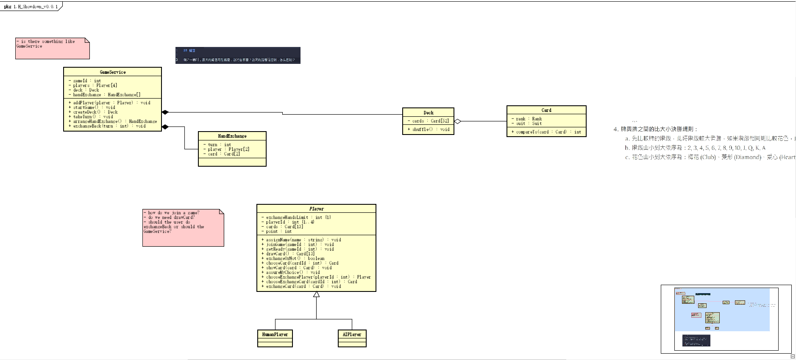

## showdown v001

## 疑惑

- 在做这一题时，最大的疑惑可能就是：游戏在哪里？游戏的流程谁来控制？怎么控制？

## 反省

- 13:21  
  视频中有回答说：在OOA这个阶段，我们并不在乎物件之间如何互动合作！
  - 这？！！在OOA的时候不关注物件之间如何互动，能做出好的设计？这不是我一直以为的疑问么？  
    - 这话要说起来感觉就长了，首先得先来定义什么是好的设计。。
    - 退一步来讲，或许这样子不能做出我理解中的好的设计，但这一定是比我想象中的更容易起步的设计。
