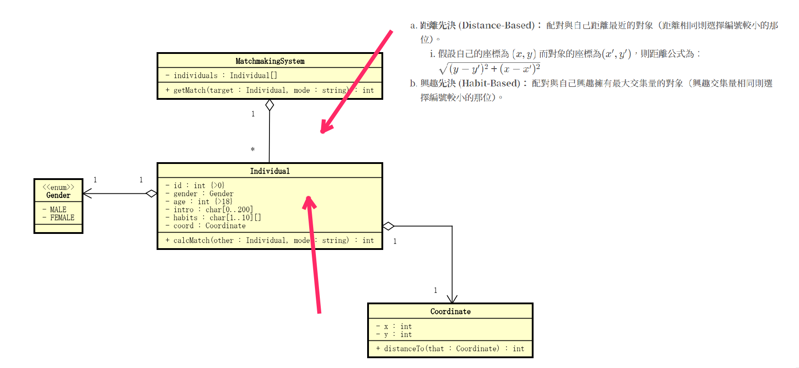

## OOA

## 疑惑

1. 找不到forces冲突点，或者说是找到了别的化解方法？
    - calcMethod到底该放到哪里？  
      放到MatchmakingSystem里？放到Indivdual里？还是两者之外？
        - 动态的load方法的话好像放哪里都不那么重要？
        - 这意思岂不是在说，这道题最大的问题在于如果不在Individual里用if/else而能使用不同方法？

## 自省

- 无法专注于问题本身？  
  相比于在给定的context之下想办法解决forces，好像总是倾向于调整context来使forces本身不存在
    - 就好比做这个题时，最大的痛苦来源于
        - 总是怀疑给的前提本身是不对的、不好的，或者说是可调整的？  
        不能老老实实地在给的前提之下去思考问题->解决问题
        - 如何让自己相信给的前提是正确的  
        或者，就不管给的前提是不是正确的，就是要在这个前提之下去思考问题
